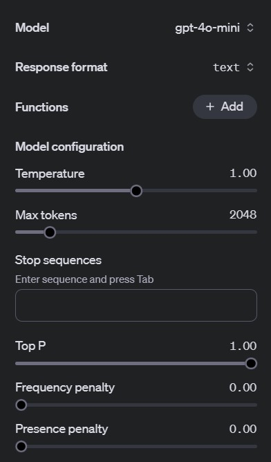

The OpenAI Playground offers a variety of features designed to help you experiment with AI models, adjust parameters, and generate responses. Here are the key features you can explore:

## Model Selection
You can choose from several AI models, including but not limited to:
- **GPT-4**
- **GPT-4o**

These models have different capabilities and can be selected from a dropdown menu.

## Custom Parameters
Fine-tune your AI interactions by adjusting several settings:
- **Temperature:** Controls the randomness of the response.
- **Max Tokens:** Limits the length of the AI’s response.
- **Top-p:** Specifies the cumulative probability distribution for token selection.
- **Frequency and Presence Pentalty:** The *frequency penalty* reduces the repetition of words or phrases, while the *presence penalty* discourages the reuse of specific words that have already appeared in the text, promoting more variety in the output.

## Interactive Interface
The Playground provides an intuitive interface where you can input prompts and receive immediate responses, making it ideal for both testing and learning.

## Code Interpreter
Use the **code feature** to input programming-related prompts, and test the output directly within the Playground.

## Save and Share
You can save your session and share the link with collaborators, enabling you to work on AI prompts together or revisit past sessions.

## Sidebar
Here is an image of the sidebar where you can control most of these things!

