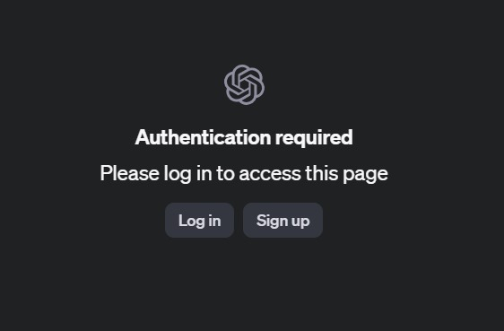

Follow these steps to start using the OpenAI Playground effectively:

## 1. Sign In
Log in to the OpenAI Playground using your OpenAI account. If you don't have one, you can sign up directly on the OpenAI website.

This is the screen you should see when opening [OpenAI Playground](https://platform.openai.com/playground/chat) for the first time:

## 2. Select a Model
From the dropdown menu, choose the AI model you want to use. You can select from models like GPT-4, GPT-3.5, and others based on availability and your subscription level. 

## 3. Enter a Prompt
Type your query or command into the prompt box. The AI will respond based on the text you provide.

## 4. Adjust Parameters
Use sliders or text fields to modify settings like:
- **Temperature** (to control randomness)
- **Max Tokens** (to control the length of the response)

These settings help fine-tune the responses you receive.

## 5. Generate
Click the **Submit** button to generate a response from the AI model.

## 6. Iterate
You can refine your prompt or adjust the parameters to get better or more specific results. The Playground is designed to allow easy experimentation and modification of inputs to improve your results.