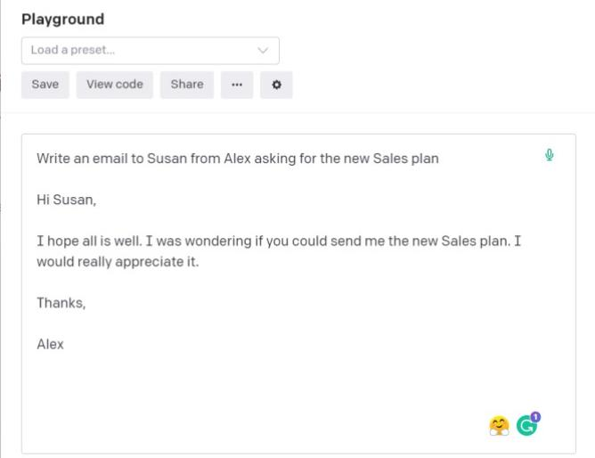

To get the most out of the OpenAI Playground, here are some tips and best practices to follow:

## 1. Start Simple
When you're new to the Playground, begin with simple and clear prompts. This will help you understand the AI’s behavior before experimenting with more complex queries.

## 2. Be Specific
Provide clear and detailed instructions in your prompts. The more specific you are, the better the AI can tailor its responses.

## 3. Experiment
Feel free to try different parameter settings like **Temperature**, **Max Tokens**, and **Top-p**. Experimenting with these settings can give you a better understanding of how they affect the generated output.

## 4. Review Examples
OpenAI provides documentation with sample prompts and use cases. Reviewing these examples can help you see the potential of the Playground and inspire your own queries.

Here is one good example of a prompt and response:

## 5. Use Iterative Refinement
Don't hesitate to adjust your prompt or parameters after reviewing the AI’s response. Iterative refinement often leads to more accurate and satisfying results.

## 6. Test Edge Cases
Push the limits of the AI by testing out edge cases or unusual scenarios. This can give you insights into how the model responds to more complex or rare situations.
